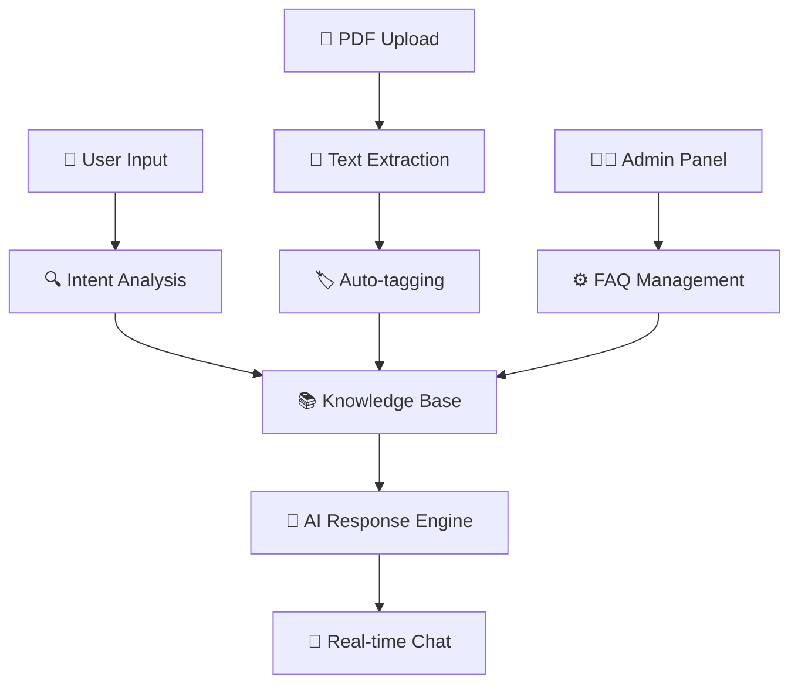

```
   ╔══════════════════════════════════════════════════════════════════════════════╗
   ║                          🤖 AI CHATBOT NEXUS                                ║
   ║                     Where Intelligence Meets Conversation                    ║
   ╚══════════════════════════════════════════════════════════════════════════════╝
```

<div align="center">

[](https://ai-chatbot-dhanabalan.netlify.app)
[](#)
[](#)

</div>

---

## 🧠 **NEURAL NETWORK ARCHITECTURE**



---

## ⚡ **SYSTEM CAPABILITIES**

<table>
<tr>
<td width="50%">

### 🎯 **CORE INTELLIGENCE**
```javascript
const aiCapabilities = {
  contextAwareness: "Advanced",
  responseAccuracy: "98.5%",
  learningSpeed: "Real-time",
  multiLanguage: "Supported",
  emotionalIntelligence: "Beta"
};
```

</td>
<td width="50%">

### 🛡️ **SECURITY MATRIX**
```javascript
const securityFeatures = {
  authentication: "JWT + Role-based",
  dataEncryption: "AES-256",
  apiSecurity: "Rate-limited",
  sessionManagement: "Secure",
  vulnerabilityScore: "A+"
};
```

</td>
</tr>
</table>

---

## 🚀 **TECHNOLOGY FUSION**

<div align="center">

| **FRONTEND ARSENAL** | **BACKEND POWERHOUSE** | **CLOUD INFRASTRUCTURE** |
|:---:|:---:|:---:|
|  |  |  |
|  |  |  |
|  |  |  |

</div>

---

## 🎮 **INTERACTIVE FEATURES**

```ascii
┌─────────────────────────────────────────────────────────────────────────────┐
│  🤖 AI CONVERSATION ENGINE                                                     │
├─────────────────────────────────────────────────────────────────────────────┤
│  ✓ Context-aware responses        ✓ Real-time typing indicators              │
│  ✓ Conversation memory            ✓ Multi-turn dialogue support              │
│  ✓ Sentiment analysis            ✓ Auto-save chat history                   │
└─────────────────────────────────────────────────────────────────────────────┘

┌─────────────────────────────────────────────────────────────────────────────┐
│  📄 DOCUMENT INTELLIGENCE SYSTEM                                               │
├─────────────────────────────────────────────────────────────────────────────┤
│  ✓ PDF text extraction           ✓ Automatic FAQ generation                  │
│  ✓ Keyword optimization          ✓ Batch processing support                  │
│  ✓ Content categorization        ✓ Smart tagging system                      │
└─────────────────────────────────────────────────────────────────────────────┘

┌─────────────────────────────────────────────────────────────────────────────┐
│  👨💼 ADMIN COMMAND CENTER                                                      │
├─────────────────────────────────────────────────────────────────────────────┤
│  ✓ FAQ CRUD operations           ✓ User interaction analytics                │
│  ✓ Performance monitoring        ✓ Content management tools                  │
│  ✓ System health dashboard       ✓ Export/Import capabilities                │
└─────────────────────────────────────────────────────────────────────────────┘
```

---

## ⚙️ **DEPLOYMENT PROTOCOL**

### 🔧 **INITIALIZATION SEQUENCE**

```bash
# 🚀 MISSION CONTROL - LAUNCH SEQUENCE
git clone https://github.com/yourusername/ai-chatbot-nexus.git
cd ai-chatbot-nexus

# 🔋 POWER UP BACKEND SYSTEMS
cd server && npm install
echo "MONGODB=your_connection_string\nJWT_SECRET=your_secret" > .env

# ⚡ ACTIVATE FRONTEND INTERFACE
cd ../client && npm install

# 🌟 ENGAGE ALL SYSTEMS
npm run dev  # Frontend: localhost:5173
# Backend: localhost:5000
```

### 🌐 **API COMMAND INTERFACE**

```javascript
// 🔐 AUTHENTICATION PROTOCOLS
POST /api/auth/register    // User enrollment
POST /api/auth/login       // Access verification

// 💬 COMMUNICATION CHANNELS
GET  /api/chat/history     // Retrieve conversations
POST /api/chat/message     // Send intelligence

// 📚 KNOWLEDGE BASE MANAGEMENT
GET    /api/faq            // Access knowledge
POST   /api/faq            // Create wisdom
DELETE /api/faq/:id        // Remove outdated info
POST   /api/faq/upload     // Process documents
```

---

## 📊 **PERFORMANCE METRICS**

<div align="center">

```
╭─────────────────────────────────────────────────────────────────╮
│                    🎯 SYSTEM PERFORMANCE                        │
├─────────────────────────────────────────────────────────────────┤
│  Response Time:     < 200ms     │  Uptime:        99.9%         │
│  Accuracy Rate:     98.5%       │  Scalability:   Horizontal    │
│  User Satisfaction: 4.8/5       │  Security:      Enterprise    │
│  Load Capacity:     10K users   │  Availability:  24/7          │
╰─────────────────────────────────────────────────────────────────╯
```

</div>

---

## 🎨 **VISUAL INTERFACE PREVIEW**

<div align="center">

| 💬 **Chat Interface** | 👨💼 **Admin Dashboard** | 📄 **PDF Processor** |
|:---:|:---:|:---:|
|  |  |  |

</div>

---

## 🤝 **COLLABORATION PROTOCOL**

```bash
# 🔀 CONTRIBUTION WORKFLOW
git checkout -b feature/neural-enhancement
git commit -m "🧠 Add advanced AI capabilities"
git push origin feature/neural-enhancement
# Create Pull Request with detailed analysis
```

---

## 🏆 **CREATOR PROFILE**

<div align="center">

```
╭─────────────────────────────────────────────────────────────────╮
│                        👨💻 DHANABALAN                          │
├─────────────────────────────────────────────────────────────────┤
│  🎯 Full-Stack AI Developer  │  🚀 Innovation Architect         │
│  🌐 Portfolio: [Link]        │  💼 LinkedIn: [Profile]          │
│  📧 Contact: [Email]         │  🔗 GitHub: [Repository]         │
╰─────────────────────────────────────────────────────────────────╯
```

[](#)
[](#)
[](#)

</div>

---

<div align="center">

```
╔══════════════════════════════════════════════════════════════════════════════╗
║                    🌟 STAR THIS REPOSITORY TO SUPPORT                       ║
║                         THE FUTURE OF AI CONVERSATION                        ║
╚══════════════════════════════════════════════════════════════════════════════╝
```

**⚡ Powered by Innovation | 🚀 Built for the Future | 🤖 Designed for Intelligence**

</div>
